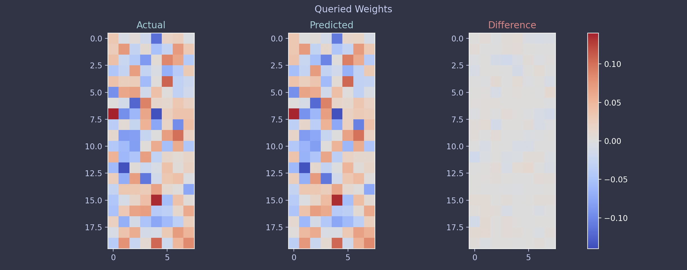

## Neural Quines

As [Wikipedia](https://en.wikipedia.org/wiki/Quine_(computing)) puts it, a **quine** is a computer program that takes no input and produces a copy of its own source code as its only output. A **neural quine** is the analogous concept for neural networks : a network that outputs its own weights. Something like this :



### Approaches Taken

#### Jacobian

Initially, I modeled the whole thing as a **regression problem** with multiple outputs. The idea was simple: treat the WHOLE neural network as a function $F_\theta(z)$ and try to make it output its own flattened parameters $\theta$:

$$
F(\theta) - \theta = 0
$$

The loss could then be written as:

$$
\mathcal{L} = \| F(\theta) - \theta \|
$$

and in principle, I could train the network using gradient descent or even **Newton’s method** if I computed the full Jacobian:

$$
J = \frac{\partial F(\theta)}{\partial \theta}, \quad
\theta \gets \theta - (J - I)^{-1} \big(F(\theta) - \theta\big)
$$


If we introduce a **scaling factor** $\alpha$ for the quine (to control the magnitude of self-replication), the loss becomes:

$$
\mathcal{L} = \| \alpha F(\theta) - \theta \|
$$

The Jacobian now includes the scaling :

$$
J = \frac{\partial (\alpha F(\theta))}{\partial \theta} = \alpha \frac{\partial F(\theta)}{\partial \theta}
$$

And the Newton-style update is updated accordingly:

$$
\theta \gets \theta - (J - I)^{-1} \big(\alpha F(\theta) - \theta \big)
$$


This allows you to control the "strength" of the quine with $\alpha$ while still using the Jacobian for Newton updates. This approach is mathematically neat, as it provides an exact fixed-point iteration : but in practice, there were several problems that I encountered later 🫠 (check the [APPENDIX](#appendix--problems-with-the-naive-jacobian-approach)). As a result, I went for a non-Jacobian approach.

#### Non-Jacobian

Apparently, this topic was explored wayyy back in [Neural Network Quine, 2018](https://arxiv.org/abs/1803.05859) (I really should have read this first 😭). This paper proposes a clever alternative : **make the network weights queryable**

**What The Paper Suggestss (Indexed Version)**

Model does something like this :

$$
F_\theta(i, j) \approx W_{ij}
$$

That would mean:

- We feed an index $(i, j)$  
- The model returns a single parameter $W_{ij}$  
- We must loop over all indices to reconstruct $\theta$

This formulation describes an **indexed neural quine**.

In that case, the full parameter vector would be reconstructed as:

$$
\theta = \{ F_\theta(i) \}_{i=1}^{P}
$$

which requires $P$ forward passes.


**What I Actually Built (Non-Indexed Version)**

Instead, our model is defined as:

$$
F_\theta : \mathbb{R}^d \rightarrow \mathbb{R}^P
$$

Where :

- $d = 8$ (input dimension)
- $P$ = total number of parameters
- $\theta \in \mathbb{R}^P$ is the flattened parameter vector

We choose a fixed probe vector :

$$
z \in \mathbb{R}^d
$$

And train the network so that :

$$
F_\theta(z) \approx \theta
$$

This means a **single forward pass** generates the entire parameter vector.

**The Fixed-Point Equation**


Training solves the nonlinear fixed-point condition:

$$
\theta^* = F_{\theta^*}(z)
$$

This means the parameters define a function that, when evaluated at a specific input $z$, outputs those same parameters.

**Input Dimension vs Parameter Dimension**

The input does **not** need to be size $P$.

The model learns this mapping :

$$
\mathbb{R}^d \rightarrow \mathbb{R}^P
$$

Where:

- $d$ = input dimension  
- $P$ = total number of parameters  

So a small latent vector $z \in \mathbb{R}^d$ generates the entire parameter vector $\theta \in \mathbb{R}^P$. That's why, after training the model, we save the `input_probes` as well


#### Improvements

Even with queryable inputs, the zero-quine problem remains. To bypass it, I followed [Evan Fletcher’s blog](https://evanfletcher42.com/2022/10/31/neural-quines/) (should've read this before too 😭 ... it's pretty good):

> We can forcibly avoid the zero quine by adding a parameter-free normalization layer after the trained dense layer. Both instance normalization and batch normalization (with all learned & running parameters disabled – no extra weights!) produce imperfect, but non-trivial, quines with relatively low error.

The reason why this works is because even though the weights CAN be zero, the gradients never are. See [APPENDIX](#appendix--proof) for a proof attempt

### How to run

```bash
# Clone the repo and go to root folder of repo
mkdir neural-quines
cd neural-quines
git clone https://github.com/Vishvam10/neural-quines


export PYTHONPATH=$(pwd)

# Jacobian
cd nnquine/jacobian
python train.py
python evaluate.py

# Non-Jacobian
cd nnquine/non_jacobian
python train.py
python evaluate.py
```

If you wish to contribute, kindly lint and format the code before raising a PR :

```bash
# Kindly lint and format the code if you plan to contribute
ruff check --config pyproject.toml
ruff check --select I --fix . --config pyproject.toml
ruff format --config pyproject.toml
```

### APPENDIX : Problems with the naive Jacobian approach

1. **The zero-quine problem**  
   - If all weights are zero, the network trivially satisfies $F(0) = 0$.  
   - Newton’s method or gradient descent will often converge to this trivial solution if the initialization isn’t perfect.  

2. **Jacobian scales poorly**  
   - For a network with $P$ parameters, the Jacobian $J$ is $P \times P$.  
   - Constructing, storing, and solving linear systems with $J - I$ becomes expensive and numerically unstable for even modest networks.  

3. **Single fixed input is limiting**  
   - The network needs some input to produce an output, but using a single “dummy” input only probes a tiny slice of the network’s behavior.  
   - This makes the reconstructed weights sensitive to the choice of input and can leave other weights poorly constrained.

4. **Nonlinear interactions and ill-conditioning**  
   - Neural quines are highly coupled : changing one weight affects multiple outputs.  
   - Newton’s method oscillates or overcorrects when the mapping is stiff, especially with normalization layers.  


### APPENDIX : Proof

Let

$$
h \in \mathbb{R}^n
$$

#### Mean

$$
\mu = \frac{1}{n} \sum_{k=1}^{n} h_k
$$

#### Variance

$$
\sigma^2 = \frac{1}{n} \sum_{k=1}^{n} (h_k - \mu)^2
$$

Define

$$
s = \sqrt{\sigma^2 + \epsilon}
$$

The normalized output is

$$
\hat{h}_i = \frac{h_i - \mu}{s}
$$

We compute the Jacobian

$$
J_{ij} = \frac{\partial \hat{h}_i}{\partial h_j}
$$


#### Step 1: Derivative of the Mean

$$
\frac{\partial \mu}{\partial h_j} = \frac{1}{n}
$$


#### Step 2: Rewrite the Variance

Using the identity

$$
\sigma^2 = \frac{1}{n} \sum_{k=1}^{n} h_k^2 - \mu^2
$$

Differentiate with respect to $h_j$:

$$
\frac{\partial \sigma^2}{\partial h_j}=\frac{2}{n} h_j-2 \mu \frac{\partial \mu}{\partial h_j}
$$

Since

$$
\frac{\partial \mu}{\partial h_j} = \frac{1}{n}
$$

we get

$$
\frac{\partial \sigma^2}{\partial h_j}=\frac{2}{n} h_j-\frac{2\mu}{n}=\frac{2}{n}(h_j - \mu)
$$

#### Step 3: Derivative of $s$

$$
\frac{\partial s}{\partial h_j}=\frac{1}{2s}\frac{\partial \sigma^2}{\partial h_j}=\frac{1}{2s}\cdot\frac{2}{n}(h_j - \mu)=\frac{h_j - \mu}{n s}
$$


#### Step 4: Differentiate the Normalized Output

$$
\frac{\partial \hat{h}_i}{\partial h_j}=\frac{1}{s}\frac{\partial (h_i - \mu)}{\partial h_j}-\frac{h_i - \mu}{s^2}\frac{\partial s}{\partial h_j}
$$

Compute the first derivative:

$$
\frac{\partial (h_i - \mu)}{\partial h_j}=\delta_{ij}-\frac{1}{n}
$$

So the first term becomes

$$
\frac{1}{s}\left(\delta_{ij}-\frac{1}{n}\right)
$$

Now substitute the derivative of $s$:

$$
\frac{h_i - \mu}{s^2}\cdot\frac{h_j - \mu}{n s}=\frac{(h_i - \mu)(h_j - \mu)}{n s^3}
$$


#### Final Expression

$$
J_{ij}=\frac{1}{s}\left(\delta_{ij}-\frac{1}{n}\right)-\frac{(h_i - \mu)(h_j - \mu)}{n s^3}
$$


#### Special Case: $h = 0$

If

$$
h = 0
$$

then

$$
\mu = 0
$$

$$
\sigma^2 = 0
$$

$$
s = \sqrt{\epsilon}
$$

The second term vanishes, giving

$$
J=\frac{1}{\sqrt{\epsilon}}\left(I-\frac{1}{n}\mathbf{1}\mathbf{1}^T\right)
$$

where

$$
\mathbf{1}=(1,1,\dots,1)^T
$$

Now this is not 0 so when the weights are updated, we get non-zero weights